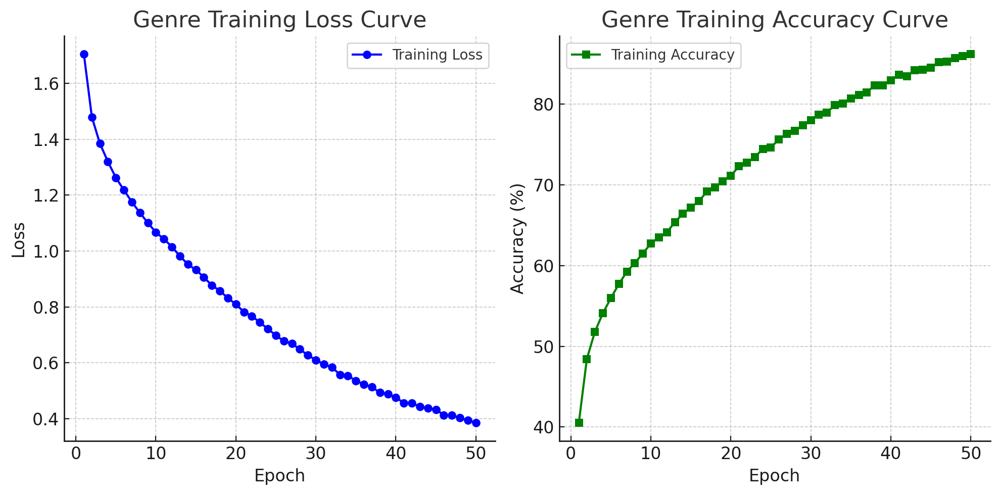

**This is the task project for GSoC 2025 application for the ArtExtract Project.**

## Introduction
Nowadays, many edge-cutting techniques are applied in the art classification filed. Among them, the deep learning skill is considerably a effective way to finish the job. CNN model and its morphs, which can take pixel data, are used as key tools and perform well. (Zhao et al., 2021) This project is trying to raise a new methond to classify the artworks with different labels such as artists, genres and styles.

The aim of the project is to predict the artist, genre and style labels based on the pixel input. Moreover, the project tried to tell the outliers from the artworks data which may help people understand the variaty and stylistic chages in the given group of works.

## Data Overview
Wikiart dataset is uesd as the original data in the project. There are 13346 marks of artist data, 45503 marks of genre data and 57025 marks of style data for training and 5706 artist marks, 19492 genre marks and 24421 style marks for testing. The struture of them are shown below.

It is clear that the distribution of the data is not even. For example, the label 3 and 5 in genre dataset own far less data than other labels. Things get worse in style data. 1, 2, 16, 25 labels owns too little data to be fully modeled.

## Methods and Models
Lecoutre et al. (2017) pointed out that Alexnet and pre-trained Resnet model perform well in artword classification.

First, I numericalize the labels of all categories by **LabelEncoder** from the **scikit-learn** library to adapt the input requirements of the neural network model. In addition, in order to improve the generalization ability of the model, the following Data Augmentation (DA) methods are used. This process includes **Resize**, **Random Horizontal Flip**, **Random Rotation**, **Random Resized Crop** and **Normalization**.

AlexNet uses **five Convolutional Layers** followed by Fully Connected Layers, with the following structure:
- **Convolutional Layer 1 (Conv1)**: \(11 \times 11\), step size 4, ReLU activation;
- **Pooling Layer 1 (Max Pooling 1)**: \(3 \times 3\), step size 2;
- **Convolution Layer 2 (Conv2)**: \(5 \times 5\), ReLU activation;
- **Pooling Layer 2 (Max Pooling 2)**: \(3 \times 3\), Step 2;
- **Convolutional Layers 3-5 (Conv3-Conv5)**: \(3 \times 3\), ReLU activation;
- **Pooling Layer 3 (Max Pooling 3)**: \(3 \times 3\), step size 2;
- **Fully Connected Layer**: two 4096-dimensional hidden layers + output layer.
ResNet-50 adopts **Residual Learning**, the core idea of which is to retain gradient information through **Skip Connections**, so as to effectively train deep neural networks. In this study, we use **ResNet-50 pre-trained model** and re-train the **last 20 layers** (Fine-tuning).

Finally, this study uses **Soft Voting** for model integration. Specifically, AlexNet and ResNet-50 generate separate predictive probability distributions on the test set, and the final classification result is taken as the average** of the predictive probabilities of the **two models, thus improving the overall classification performance.

## Model Training and Evaluation
As shown in the figures below, the Resnet models converges more quickly. However, Alexnet model has better generalization ability, as Alexnet model got 89.28%, 86.03% and 79.83% on the test data while Resnet model got 94.94%, 75.31% and 56.56%.

**Alexnet model's performance**

**Resnet model's performance**

In order to taking the advantages of both models, soft voting strategy has been applied. Based on the perfomance of the models on the test data, they got different weight when voting. After stacking the two model, the accuracy rate increased considerably.

The stacked model's confusion matrixs are shown below.

## Results and Discussion
The final accuracy of the stacked model is 80.79% in artist data, 71.41% in genre data and 49.50% in style data. It is clear that the style classification is not ideal enough. There are two main reasons of the result. Firstly, the style of a given picture is debatable. It is fear to take a picture as different styles for different reasons. Thus, we may adjudt the evaluation methodology into if the style label in the top 3 propably styles. After adjusting the metho, the accuracy will increase to 80.42%.

Another reasons is the uneven distraction of the data. For example, in style data, label 18 has too many marks so that many other labels is confused for label 18.

## Reference
Zhao, W., Zhou, D., Qiu, X., & Jiang, W. (2021). Compare the performance of the models in art classification. Plos one, 16(3), e0248414.
Lecoutre, A., Negrevergne, B., & Yger, F. (2017, November). Recognizing art style automatically in painting with deep learning. In Asian conference on machine learning (pp. 327-342). PMLR.